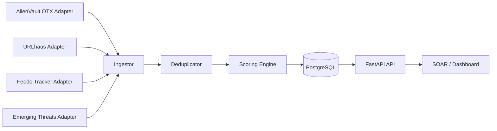

# Architecture

## System Overview

The Threat Intel Aggregator and Correlation Engine ingests indicators from four open feeds, normalizes and deduplicates records into canonical IOCs, and computes a confidence-arbitrated verdict that is queryable by SOAR systems during enrichment workflows.

## Core Components

- Feed Adapters (`threat_intel/feeds/*`)
  - Each adapter owns source-specific auth, fetch strategy, pagination, and parsing.
  - Adapters emit `NormalizedIOC` records only.
- Ingestor (`threat_intel/pipeline/ingestor.py`)
  - Runs one feed end-to-end and records ingestion logs.
  - Supports concurrent all-feed execution.
- Deduplicator (`threat_intel/pipeline/deduplicator.py`)
  - Upserts canonical IOC by `(ioc_value, ioc_type)`.
  - Preserves per-source observation rows and locks canonical row with `SELECT FOR UPDATE` semantics.
- Scoring Engine (`threat_intel/scoring/*`)
  - Applies source weight, recency decay, corroboration multiplier, and clamping.
  - Recomputes score on every write event.
- API (`threat_intel/api/*`)
  - IOC enrichment, feed/admin controls, stats endpoints, and graph cluster endpoints.
- Dashboard (`dashboard/*`)
  - Jinja templates + vanilla JS + Chart.js to visualize volumes, confidence distribution, and top indicators.

## Data Flow

1. Scheduler (or manual admin trigger) starts feed ingestion.
2. Adapter fetches current feed snapshot and returns normalized IOC objects.
3. Deduplicator upserts canonical IOC and source observation rows.
4. Scoring engine recomputes confidence and verdict immediately.
5. API serves the latest computed state for SOAR and dashboard clients.
6. Analyst feedback updates source counters, can lower source weights, and writes score history snapshots.
7. Alert context can be posted to graph endpoints to create IOC co-occurrence edges and connected clusters.

## Storage Model

- `iocs`: canonical indicator records and current score/verdict.
- `ioc_observations`: per-source observation metadata.
- `source_configs`: editable weights, per-type lambdas, and quality counters.
- `ingestion_logs`: per-run feed ingestion telemetry.
- `verdict_feedback`: analyst TP/FP feedback.
- `ioc_score_history`: historical score snapshots for explainability and drift analysis.
- `alert_events`: deduplicated external alert identifiers for graph ingestion.
- `ioc_graph_edges`: undirected IOC co-occurrence edges with support counts.

## Operational Notes

- Async I/O is used for both HTTP and DB paths.
- Scoring and arbitration logic are source-agnostic and adapter-independent.
- Source weights and lambdas are database-resident for runtime adjustability.
- Scheduler jobs are per-feed and configurable by environment variables.
